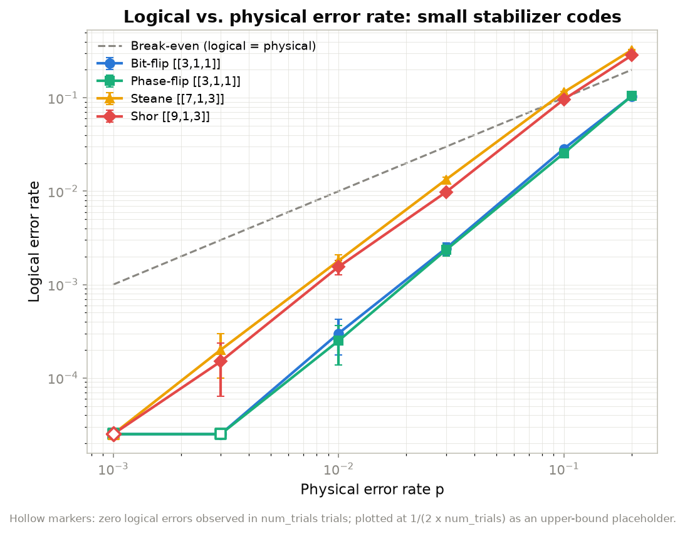
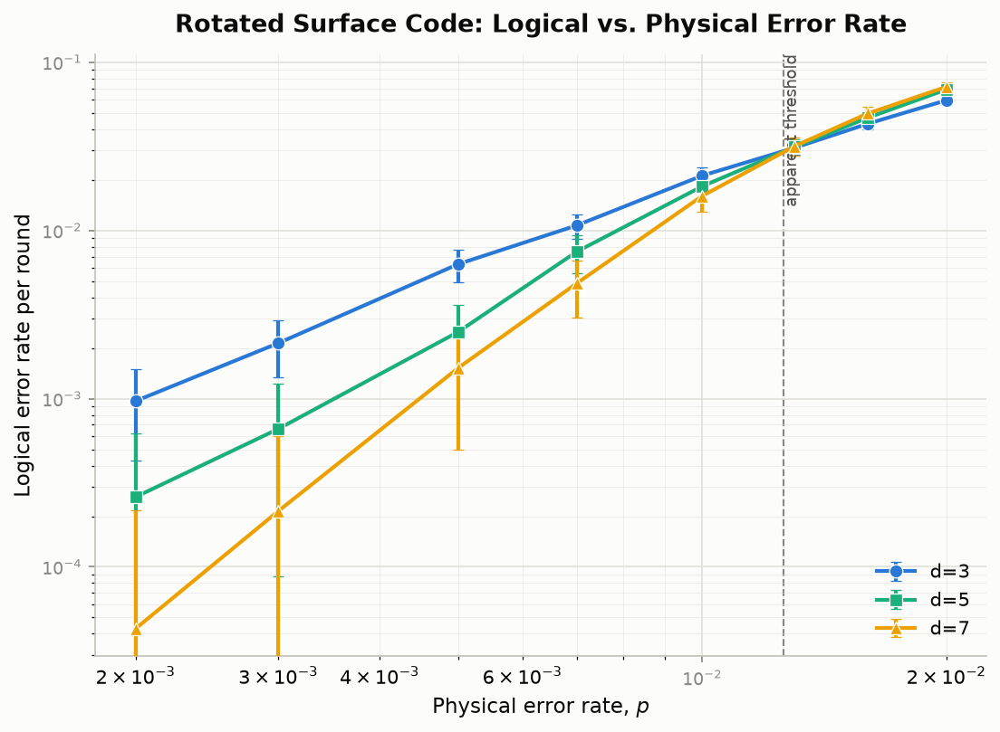
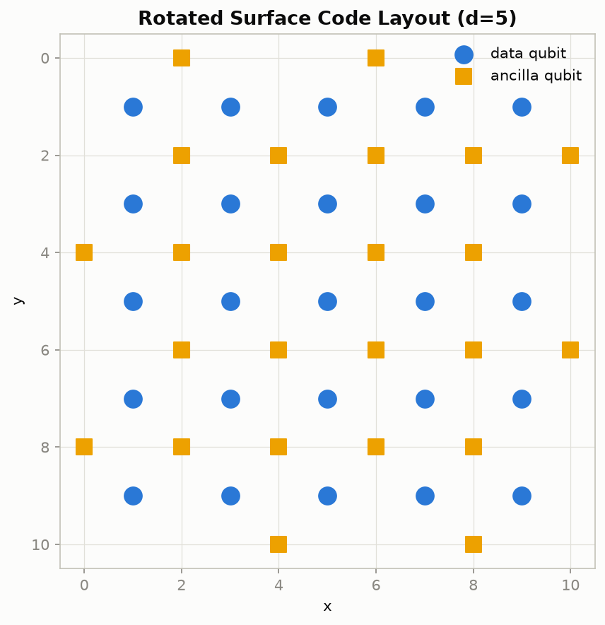

# Stabilizer Quantum Error Correction

A custom Python implementation of quantum stabilizer codes: encoding, syndrome
measurement, decoding, Monte Carlo error-injection simulation, and performance
visualization.

The project has two complementary halves:

1. **A custom stabilizer engine** (`qecsim/pauli.py`,
   `qecsim/stabilizer_code.py`, `qecsim/codes.py`, `qecsim/encoding_circuits.py`,
   `qecsim/simulate.py`) implementing the binary symplectic (Gottesman) theory,
   applied to four classic small codes: the 3-qubit bit-flip and phase-flip codes,
   the Steane `[[7,1,3]]` CSS code, and the Shor `[[9,1,3]]` code, including an
   explicit statevector simulation of the encoding circuit.
2. **A realistic surface-code simulation** (`qecsim/surface_code.py`,
   `qecsim/threshold.py`) using [Stim](https://github.com/quantumlib/Stim) for
   circuit-level noisy simulation of the rotated surface code and
   [PyMatching](https://github.com/oscarhiggott/PyMatching) for minimum-weight
   perfect matching (MWPM) decoding.

## Setup

```bash
python3 -m venv .venv
source .venv/bin/activate
pip install -r requirements.txt
```

## Running

```bash
# Custom stabilizer codes: encode, inject errors, decode, sweep error rates
python scripts/demo_small_codes.py

# Surface code: Stim + PyMatching threshold sweep
python scripts/run_threshold_sweep.py

# Tests
pytest tests/ -v
```

## Results

**Small codes - logical vs. physical error rate** (depolarizing noise, 20,000 trials/point):



**Rotated surface code - threshold plot** (circuit-level depolarizing noise, Stim + PyMatching MWPM, 10,000 shots/point):



**Rotated surface code lattice** (distance 5):



## Project layout

```
qecsim/
  pauli.py               binary symplectic Pauli representation
  stabilizer_code.py      general [[n,k]] StabilizerCode engine + lookup decoder
  codes.py                 bit-flip, phase-flip, Steane, Shor code definitions
  encoding_circuits.py    statevector encoding circuit / stabilizer-projector demo
  simulate.py              Monte Carlo logical error rate simulation
  viz_small_codes.py       plotting for the small-code results
  surface_code.py          Stim circuit generation + PyMatching decoding
  threshold.py              surface code threshold sweep
  viz_surface_code.py      threshold plot + lattice diagram plotting
scripts/
  demo_small_codes.py       end-to-end demo for the small codes
  run_threshold_sweep.py    end-to-end surface code threshold sweep
tests/                      pytest suite (25 tests) for both halves
data/, figures/              generated CSVs and plots
```

## Acknowledgements

Built using:
- [Stim](https://github.com/quantumlib/Stim): Craig Gidney, "Stim: a fast stabilizer circuit simulator," Quantum 5, 497 (2021), [arXiv:2103.02202](https://arxiv.org/abs/2103.02202).
- [PyMatching](https://github.com/oscarhiggott/PyMatching): Oscar Higgott, "PyMatching: A Python package for decoding quantum codes with minimum-weight perfect matching," ACM Transactions on Quantum Computing 3(3) (2022), [arXiv:2105.13082](https://arxiv.org/abs/2105.13082).

References for the codes and theory implemented here:
- D. Gottesman, "Stabilizer Codes and Quantum Error Correction," PhD thesis (1997), [arXiv:quant-ph/9705052](https://arxiv.org/abs/quant-ph/9705052).
- P. W. Shor, "Scheme for reducing decoherence in quantum computer memory," Phys. Rev. A 52, R2493 (1995).
- A. M. Steane, "Error Correcting Codes in Quantum Theory," Phys. Rev. Lett. 77, 793 (1996).
- A. G. Fowler, M. Mariantoni, J. M. Martinis, A. N. Cleland, "Surface codes: Towards practical large-scale quantum computation," Phys. Rev. A 86, 032324 (2012), [arXiv:1208.0928](https://arxiv.org/abs/1208.0928).

Further reading:
- M. A. Nielsen & I. L. Chuang, *Quantum Computation and Quantum Information* (Cambridge University Press) 
  - Ch. 10 covers the stabilizer theory and fault tolerance in depth.
